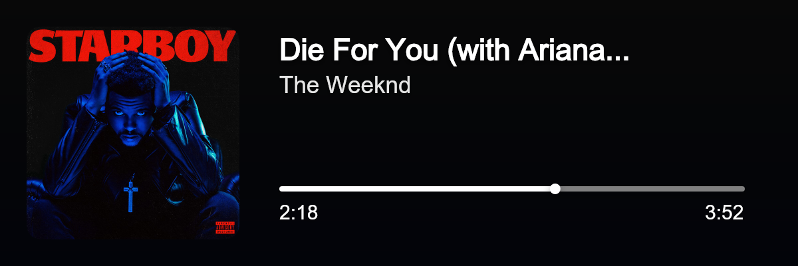
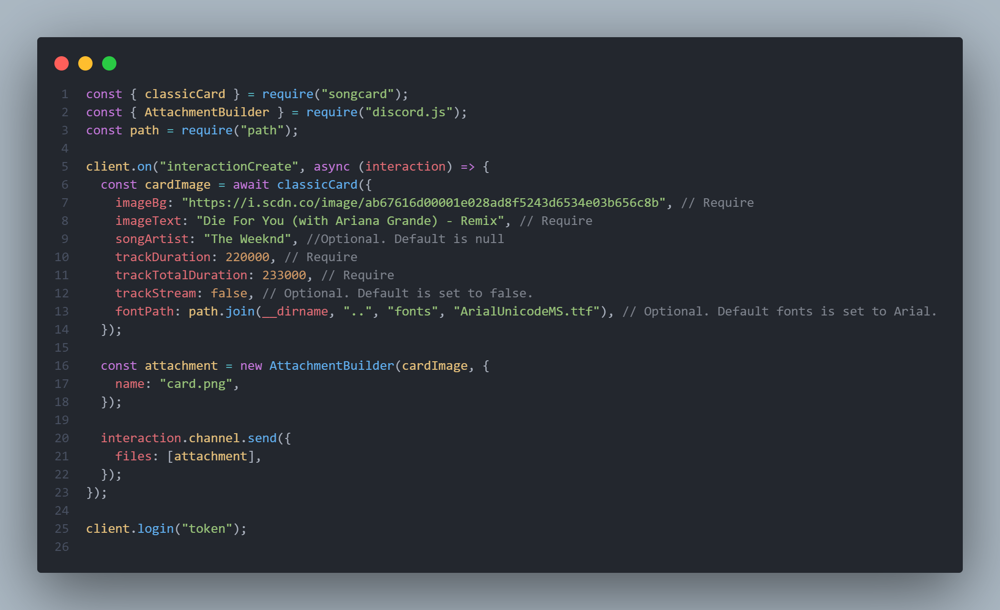
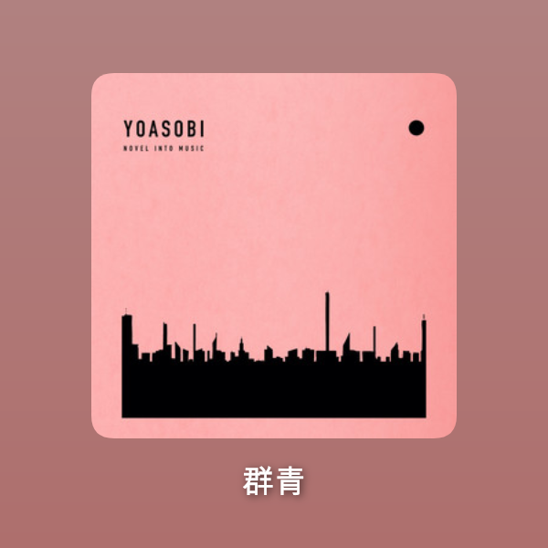
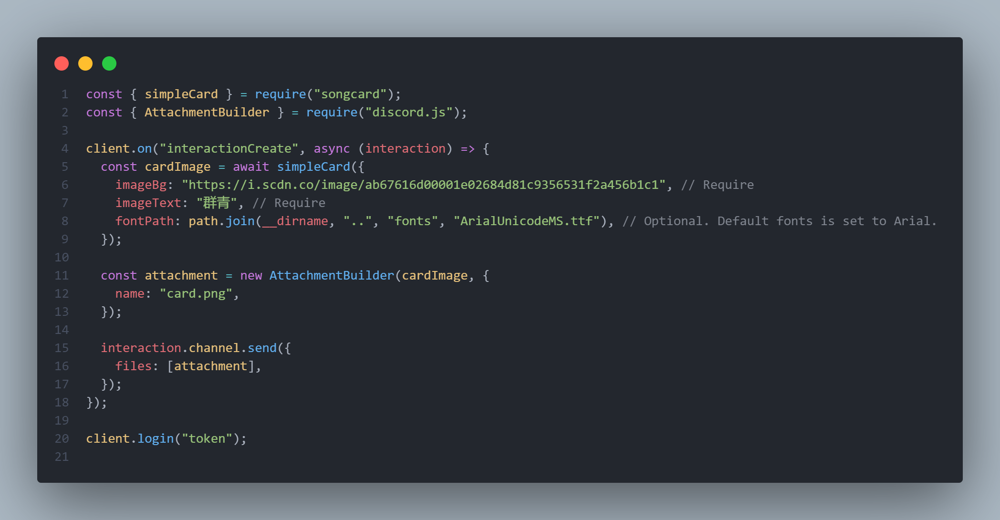
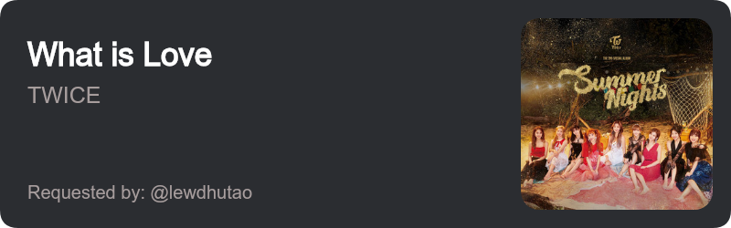
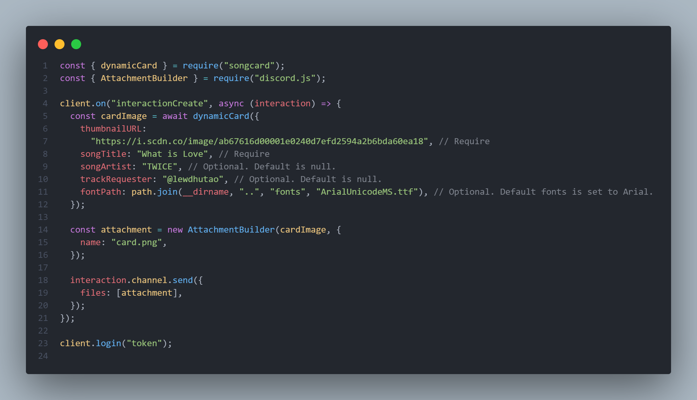

<div align="center">
  <h1>songcard</h1>
  <p>A simple package to create song card when play songs in discord.</p>
  <p>
  <a href="https://www.npmjs.com/package/songcard"></a>
  <p>
  <p>
    <a href="https://www.npmjs.com/package/songcard"></a>
  </p>

  <p>This package was originally used only for my personal needs to generate a song card when users play songs using my Discord bot, but then I decided to make this package open source and let everyone use it.</p>
  </div>
  <br>

  ## Install
```sh
npm install songcard
# or
yarn add songcard
```

<br>

# Themes

## 1. Classic




### Example



<br>

## 2. Simple



### Example



## 3. Dynamic



### Example




