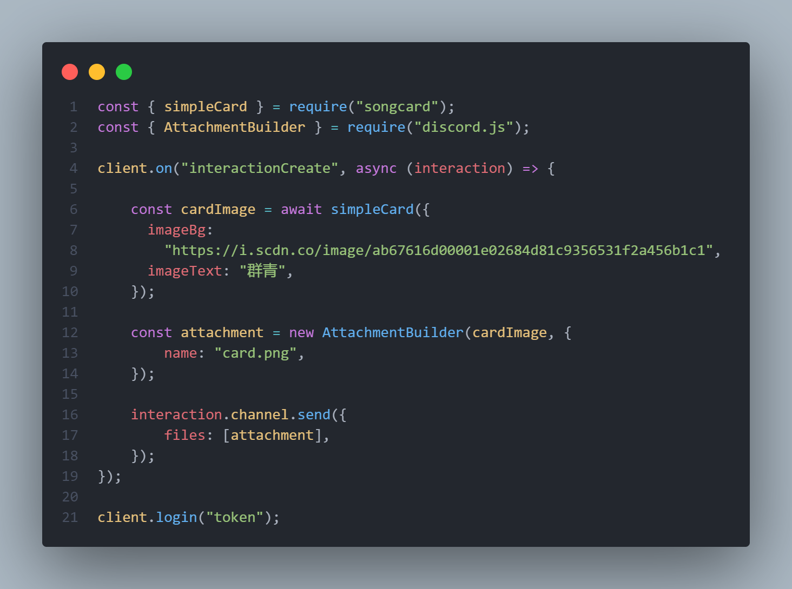

<div align="center">
  <h1>songcard</h1>
  <p>A simple package to create song card when play songs in discord.</p>
  <p>
  <a href="https://www.npmjs.com/package/songcard"></a>
  <p>
  <p>
    <a href="https://www.npmjs.com/package/songcard"></a>
  </p>

  <p>This package was originally used only for my personal needs to generate a song card when users play songs using my Discord bot, but then I decided to make this package open source and let everyone use it.</p>
  </div>
  <br>

  ## Install
```sh
npm install songcard
# or
yarn add songcard
```
<br>

## Usage

| Option                 | Type                   | Description                                                                                                                                          |
|------------------------|------------------------|------------------------------------------------------------------------------------------------------------------------------------------------------|
| imageBg                | String                  | Image that will be display to the songcard. <br><br> Example: https://images-ext-1.discordapp.net/external/uw_-bWFyeXnWb11wGThe2CAbTYdrxzFqMJ2trxDIYVE/https/i.scdn.co/image/ab67616d0000b2738ad8f5243d6534e03b656c8b?width=468&height=468 <br>File format: PNG/JPEG                      |
| imageText              | String                  | Text that will be display to the songcard.                                                                                                        |
| trackStream            | Boolean                 | Whether to set the trackDuration and trackTotalDuration to `LIVE`<br><br>Example: if trackStream is `true` the trackDuration and totalTrackDuration will show as `LIVE` else it will show number. |
| trackDuration          | Integer                 | Show current duration of the songs. If no value provide it will show `0:00`.                                                                                                      |
| trackTotalDuration     | Integer                 | Show the songs duration.                                                                                                    |

<br>

# Themes

## 1. Classic


### Example


<br>

## 2. Simple


### Example




